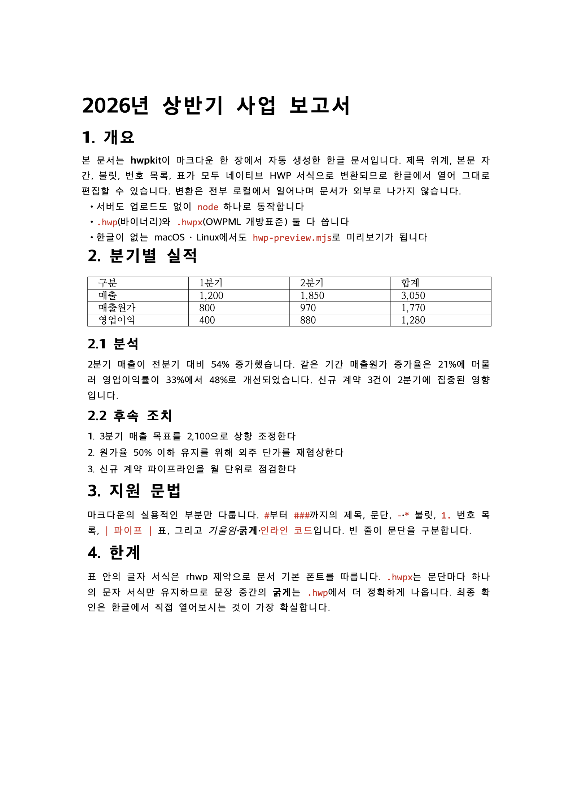

# hwpkit

**Read, write and preview Korean HWP / HWPX documents (한글) from Claude, Claude Cowork, Codex, Cursor, Gemini CLI, or the command line — locally, with no server and no upload.**

[](https://github.com/yuyu04/hwpkit/actions/workflows/ci.yml)
[](LICENSE)
[](https://nodejs.org)
[](README.ko.md)

Claude — and AI document tools built on it, like **Claude Cowork** — can create and read
`.docx`, `.pptx`, `.xlsx`, `.pdf`, and Markdown, but **not** Korea's `.hwp` / `.hwpx`,
because no HWP library exists in their runtime. hwpkit fills that gap: it ships the
[rhwp](https://github.com/edwardkim/rhwp) HWP engine (compiled to WebAssembly) plus small
Node.js scripts, packaged as an **Agent Skill / plugin** that runs entirely on your machine.

<p align="center">
  
</p>

<p align="center">
  <em><a href="examples/sample.md">examples/sample.md</a> → <a href="examples/sample.hwp">sample.hwp</a>, rendered by <code>hwp-preview.mjs</code> — no Hancom Office involved.</em>
</p>

## What it does

| | |
| --- | --- |
| **Read** | `.hwp` / `.hwpx` → text, including table contents, so Claude can summarize, quote, translate, or analyze Korean documents. |
| **Write** | Markdown → `.hwp` / `.hwpx` with real heading hierarchy, body typography, bullets, numbered lists, inline emphasis, and native HWP tables. |
| **Preview** | Any `.hwp` / `.hwpx` → SVG or PNG, on macOS and Linux, **without Hancom Office installed**. |

Everything runs locally — inside Cowork's VM or your own machine. No server, no upload;
your documents never leave the environment.

## Quick start

### Claude Cowork

Cowork runs a Linux VM with Node.js pre-installed, so hwpkit's scripts execute inside it.
There are two ways to use it; **Method A is the most reliable.**

**Method A — clone into your Cowork folder and run the scripts (recommended)**

1. In the folder you gave Cowork access to:
   ```bash
   git clone https://github.com/yuyu04/hwpkit
   ```
   (`node_modules` + the rhwp WASM are committed, so **no `npm install` is needed**.)
2. Then just ask Cowork:
   - **Read:** *"read this .hwp with hwpkit/scripts/hwp-read.mjs"*
   - **Write:** *"draft this as Markdown, then convert to HWP with hwpkit/scripts/hwp-write.mjs"*

**Method B — install as a Cowork plugin (skills activate automatically)**

Cowork → **Customize → Plugins → add a custom plugin**, using the GitHub source
`yuyu04/hwpkit`. Once installed, the skills fire automatically whenever you ask Cowork to
read or produce a `.hwp` / `.hwpx` file — no explicit script path needed.

> Adding a plugin from a GitHub repo is currently in beta. If it doesn't connect, download
> the repo as a ZIP and use "upload a custom plugin file", or just use Method A.

### Claude Code

```bash
git clone https://github.com/yuyu04/hwpkit
claude --plugin-dir ./hwpkit
```

### Other AI agents (Codex, Cursor, Gemini CLI, Aider…)

The scripts are a plain CLI, so any agent that can run a shell command can use hwpkit.
[AGENTS.md](AGENTS.md) — the cross-tool instruction standard — tells it how: the commands,
the supported Markdown subset, when to pick `.hwp` over `.hwpx`, and to verify output with
a preview instead of guessing.

```bash
git clone https://github.com/yuyu04/hwpkit
```

Codex, Cursor, Aider, Zed, Windsurf and others pick up `AGENTS.md` automatically.
**Gemini CLI** needs one line in `settings.json`:

```json
{ "context": { "fileName": ["GEMINI.md", "AGENTS.md"] } }
```

ChatGPT's web app can't reach a local tool — it only connects to remote HTTPS endpoints,
which would mean uploading your documents. That trade-off is yours to make; hwpkit doesn't
ship it.

### Plain CLI

```bash
git clone https://github.com/yuyu04/hwpkit && cd hwpkit
# dependencies are bundled; npm install is optional

node scripts/hwp-read.mjs    report.hwp              # read  → stdout
node scripts/hwp-write.mjs   report.md report.hwp    # write → .hwp
node scripts/hwp-write.mjs   report.md report.hwpx   # write → .hwpx
node scripts/hwp-preview.mjs report.hwp out/ --png   # preview → SVG + PNG
```

Requires Node.js 18+.

## Preview HWP without Hancom Office

HWP is hard to inspect off Windows. rhwp carries its own layout engine, so hwpkit can
rasterize a page anywhere Node runs — useful for checking output, code review, CI diffs,
or just seeing what a `.hwp` someone sent you actually contains.

```bash
node scripts/hwp-preview.mjs report.hwp out/            # SVG, zero dependencies
node scripts/hwp-preview.mjs report.hwp out/ --png      # + PNG (uses Chrome as rasterizer)
node scripts/hwp-preview.mjs report.hwp out/ --pages 2-4 --scale 3
```

SVG output needs nothing but Node. `--png` uses an installed Chrome/Chromium/Edge purely
as a rasterizer (no scripting, no network); point `CHROME_PATH` at it if it isn't found.

This is rhwp's renderer, not Hancom's — fonts and pagination are close but not identical.
For final visual sign-off, open the file in 한글.

## Supported Markdown (write)

| Markdown | Result |
| --- | --- |
| `#` `##` `###` | Heading, sized for hierarchy (22 / 17 / 14 / 11.5pt), bold |
| plain lines | Paragraph (맑은 고딕 10pt, 160% line spacing); consecutive lines soft-wrap into one paragraph |
| `- item` / `* item` | Bullet paragraph (`• item`), indented; nesting by indent |
| `1. item` | Ordered item, indented |
| `**bold**` `*italic*` `` `code` `` | Inline character styling (`.hwp` only — see limitations) |
| `[text](url)` `` | Reduced to their visible text |
| `\| a \| b \|` | Real HWP table; the `---` separator row is ignored |

## How it works

- `vendor/rhwp/` — the rhwp engine compiled to WebAssembly (MIT). Runs in Node with a
  lightweight text-measurement shim (there is no `<canvas>` in Node; exact glyph widths
  only affect layout hints, which HWP viewers recompute on open).
- `scripts/hwp-read.mjs` — loads the document and reconstructs text from the rendered layout.
- `scripts/hwp-write.mjs` — builds a document from Markdown via the engine's editing API and
  exports `.hwp` / `.hwpx`.
- `scripts/hwp-preview.mjs` — renders pages to SVG, and optionally to PNG.
- `scripts/hwp-fix-tables.mjs` — post-processes `.hwp` bytes to rewrite freshly-created table
  `CTRL_HEADER`s to the correct 48-byte layout (a JS port of the same fix hop's desktop app
  applies on save), so tables render and anchor correctly in Hancom.

```bash
npm test    # Markdown → .hwp/.hwpx → re-read round trip, page geometry, SVG render
```

## Limitations

- **Inline emphasis is `.hwp` only.** rhwp's HWPX writer collapses each paragraph to a
  single character run, so mid-paragraph `**bold**` is lost in `.hwpx` (headings, fonts,
  sizes, spacing and indentation still apply). Prefer `.hwp` when emphasis matters.
- **Table cells keep the document's default font** — rhwp cannot restyle freshly-created
  cells. They render normally in 한글, just not in a custom font.
- **Reading flattens layout** into reading order rather than reconstructing Markdown
  tables; multi-column and nested tables come out as linear text.
- Images and template-preserving fills are not implemented yet.
- Pagination can differ slightly between `.hwp` and `.hwpx` output for the same Markdown.

## Format background

`.hwpx` is an open national standard (**OWPML / KS X 6101**) — a ZIP of XML, similar to
`.docx`. Legacy `.hwp` is an OLE compound binary whose spec Hancom published in 2010.
Implementing interoperable readers/writers from these specs is well-established
(LibreOffice, pyhwp, hwp.js, ONLYOFFICE).

## Contributing

Bug reports with a sample document are especially welcome — HWP has many dialects in the
wild. See [CONTRIBUTING.md](CONTRIBUTING.md).

## License

MIT — see [LICENSE](LICENSE). Bundles the rhwp engine and other components under their own
licenses; see [THIRD_PARTY_NOTICES.md](THIRD_PARTY_NOTICES.md). "HWP", "한글", and "Hancom"
are trademarks of Hancom Inc.; this project is an independent, unaffiliated,
HWP-compatible tool.
